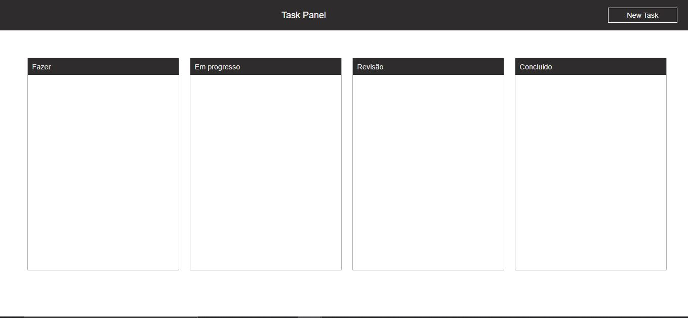
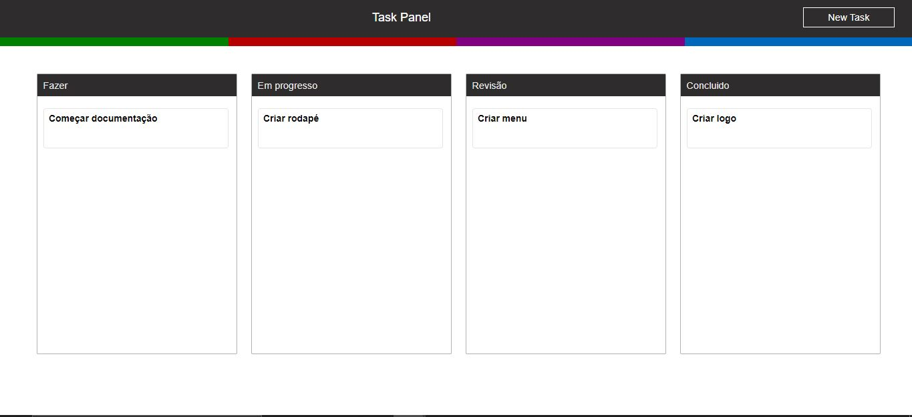
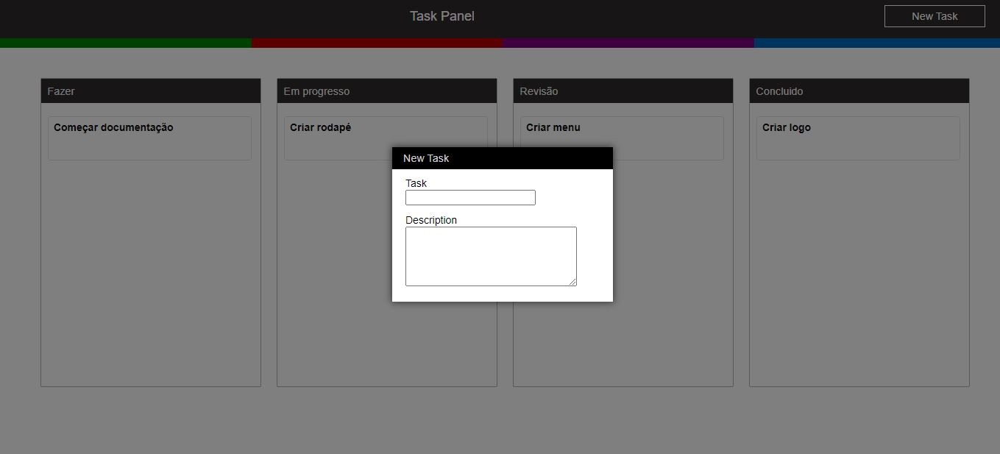

<h1 align="center">
  Task Panel
   
    
  
 
</h1> 

 <strong>Site de gerenciamento de projeto e tarefas.</strong> 

##  :notebook_with_decorative_cover: Sobre
Task Panel é um site básico de gerenciamento de projeto, com o objetivo de organizar tarefas dentro de um projeto que foi realizado na disciplina Desenvolvimento WEB com JavaScript.
Realizado elos seguintes integrantes:
- **Leandro Henrique Lima e Silva** 
- **Gabriela Maria Sinastre** 
 

## :rocket: Layout
- **Principal** 

- **Tarefas** 

- **Nova Tarefa**

